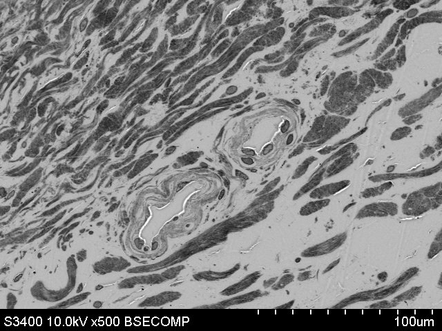
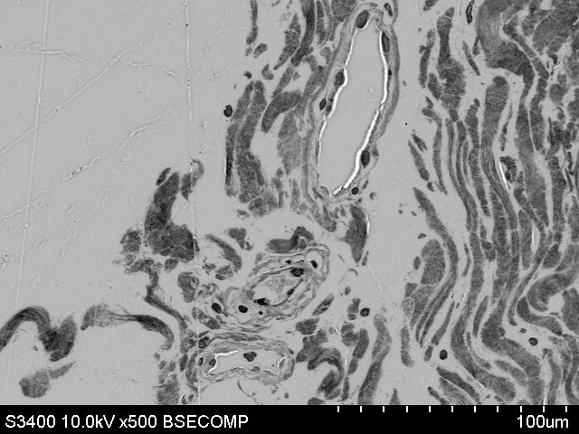
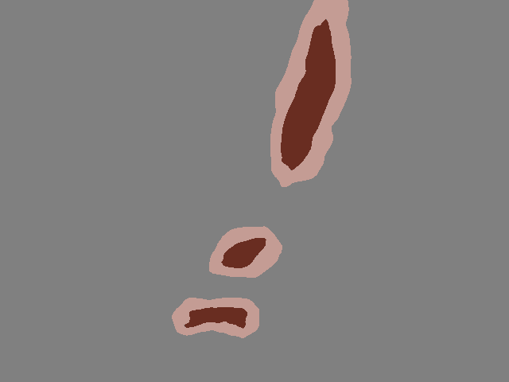
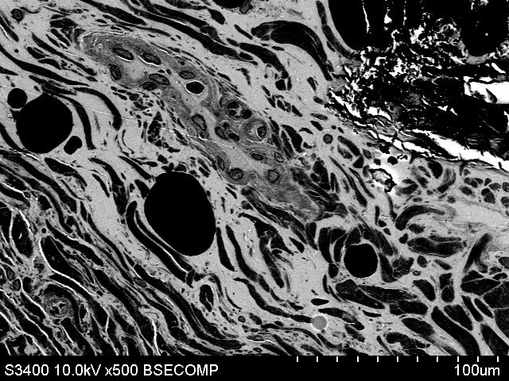

# Histology segmentation
This repository is dedicated to the segmentation of histology images acquired by a [scanning electron microscope](https://en.wikipedia.org/wiki/Scanning_electron_microscope) (SEM)

## Requirements

- Linux or macOS (Windows has not been officially tested)
- Python 3.8.x

## Installation

Step 1: Download and install Miniconda
``` bash
wget https://repo.anaconda.com/miniconda/Miniconda3-py38_22.11.1-1-Linux-x86_64.sh
chmod +x Miniconda3-latest-Linux-x86_64.sh
./Miniconda3-latest-Linux-x86_64.sh
```

Step 2: Clone the repository, create a conda environment and install the requirements for the repository
``` bash
git clone https://github.com/ViacheslavDanilov/sem_segmentation.git
cd sem_segmentation
chmod +x create_env.sh
source create_env.sh
```

Step 3: Initialize git hooks using the pre-commit framework
``` bash
pre-commit install
```

Step 4 (Optional): Download a raw dataset using DVC
``` bash
dvc pull dvc/data/raw.dvc
```
NOTE: Since data storage is organized through Google Drive, you should first request access to the [DVC repository](https://drive.google.com/drive/folders/1nYxQ6IXYdatgxXMsPzV-xjdv6PLjvMZK?usp=share_link).

## Data

| **№** |                 **Source image**                  |                   **Segmentation mask**                    |
|:-----:|:-------------------------------------------------:|:----------------------------------------------------------:|
|   1   |  |  |
|   2   |  |  |
|   3   |  |  |
